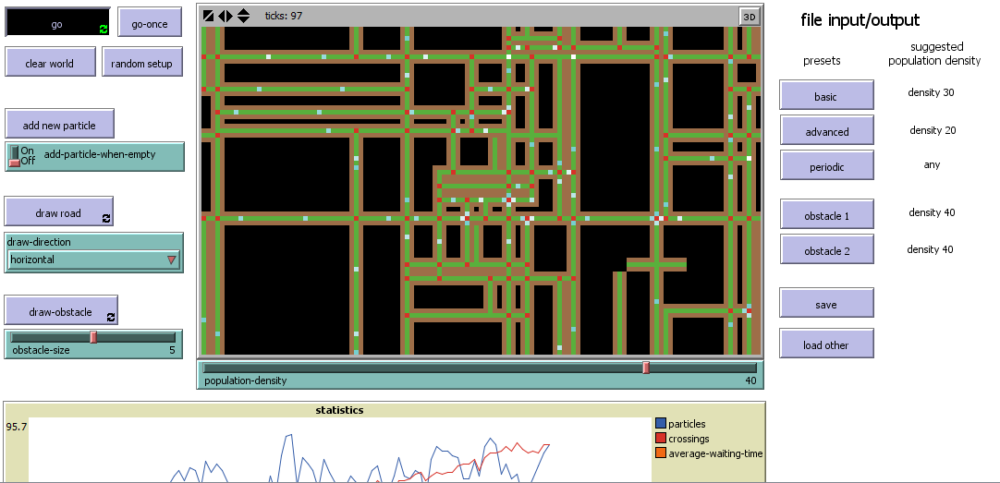

## A Cellular Automaton

### What is it?

A cellular automata that models adaptive transport. White particles are transported over a green road, which is protected by brown walls. When the particles collide, they will die and a new road is created, perpendicular to the original one. This results in a cross-section. When a different particle reaches this crossing, it will become the flow controller of that crossing.

Flow controllers have a red colour and decide whether particles are allowed to go through. This process is adaptive, which leads to a global state where the number of particles will pulse around a fixed number. The value of this number is in direct relation with the amount of particles that the flow controllers lets through.

This process is visualized in the graph at the bottom of the simulation.

As the simulation continues, the amount of crossings will increase (red line).
The amount of particles (blue line) will have a pulsing, (very rough) sinus-like behavior. This is the same for the avarage waiting time (orange line). The average waiting time stands for the avarage time that the flow controllers will wait before they will let through any particles. These two values depend on eachother recursively:

Imagine there are many particles. This means that the avarage waiting time of the flow controllers will increase, since they want to stabilize this amount. Because of this, a lot of particles will die (the flow controllers will not let the particles through). This leads to less particles, which will allow the flow controllers to decrease their waiting time. This will again result in more particles (the flow controller will let through the particles), and the circle is round.

The system can also respond to obstacles. Roads that lead to obstacles will be destroyed, which means that in time, only roads around the obstacle will survive.

### How it works

The simulation consists of the following patches:
- Particles (white)
- Roads (green)
- Flow controllers (red)
- Walls (brown)
- Obstacles (magenta)

Because this is a cellular automata, every patch can only change itself, but it is able to see its neighbors. Based on the states of his neighbors it is able to make a decision for its own next state.

--- Particles
Particles will have a different tint, based on their direction. 
When a particle reaches an obstacle it will turn pink, else it will simply turn green again.

--- Roads
A road patch will look for incoming patches, and for pink colours. If it detects a pink color, it will delete itself. When it is also near a crossing and it detects a pink color, it will become a wall. In this way, roads are only deleted until the crossing.

--- Flow controllers
Flow controllers have a default wait value (DWV) and a current waiting value (CWV). The CWV will decrease over time, until it is zero. Every time a particle enters, the crossing will check if the CWV is zero. If it is zero, the crossing will allow the particle to move in every direction on the crossing, the DWV will be decreased and the CWV will be set to the DWV. If the CWV is not zero, the particle will be deleted and the DWV is increased.

This means that the DWV is adjusted to the amount of incoming particles. Every time a particle enters and the CWV is not zero, the DWV will be increased. Therefore, the next time the crossing will have a longer waiting time.

--- Walls
The wall patch exists purely for practical purposes. It is an extra protection to make sure that the roads collide properly.

--- Obstacles
Obstacles can only be added by the user. they have no properties except that they are magenta coloured and very evil.

### How to use it

The GUI consists of roughly four categories:

1. Controlling the simulation
Go/go once: start the simulation, forever or for one tick
Clear world: make the world completely black
Random setup: this will create a random amount of roads, in random places. note that it will not add particles. It might take a while to the simulation to start. There will be several roads but no flow controllers yet. This means that all flow controllers have to be created with a particle first. Therefore it is suggested to enable 'add-particle-when-empty' and wait for a while.

2. Manipulating the simulation
    - Add new particle: add a particle in at a random place in the simulation. Only possible when there is a road.
    - (ON/OFF) Add particle when empty: often (especially at the beginning of the simulation), all the particles will have died. This can be because they all have collided, or have become flow controllers. ith this option, whenever there are zero particles, a new particle will be added automatically and thus the simulation will never stop.
    - Draw road: the user can click on the simulation and add a roadpiece, this road will be automatically extended.
    - Draw direction: the direction of the road.
    - Draw obstacle: lets the user draw an obstacle in the simulation.

3. File input/output
    Five presets have been made, and a population density is suggested for each preset.
    - Basic: the start of a simulation
    - Advanced: a simulation that has been running for quite a while.
    - Periodic: a repeating pattern, also clearly visible in the graph!
    - Obstacle 1: example of an obstacle that has just been placed in a simulation.
    - Obstacle 2: an obstacle in the shape of an M, which is of course crazy funny.

  Also, the user has the possiblity to save/load custom presets.

4. Graph
The output graph, see above for an explanation.

### Things to Notice

- I have used different dimensions for the world. it also runs perfectly on the asked sizes (100x60), but a little more slow. I believe that the simulation comes more to its right in the current size. I discussed this with Alexander and he told me that it was not problem as long as i mentioned it. Please notice that the presets will not run on other dimensions.
- The particles can only move in straight lines, so they cannot make curves.
- Sometimes, regions will be filled with brown and green (especially when starting with a random setup) but this does not affect the simulation. Its simply a result of the interactions.
- In rare occassions, an obstacle will lead to total chaos. This is because obstacles are evil and sometimes take-over the simulation.

### Things to try

- Start the periodic preset and let it run for a while. Notice the graph.
Then add a particle (which will be placed randomly) and see how it affects the simulation. Isn't it remarkable that such a little addition can turn perfect harmony into total chaos?

- Create a new simulation and let it run until there is a good flow. Then try to lower the population density as much as possible without letting it die. At this point, the most interesting patterns emerge.

- Observe the graph for a while when you make changes. It is very interesting to see how the avarage-waiting-time and the amount of particles respond to eachother.

- Notice that every state is totally reproducable! As long as the user doesn't add anything, everything is deterministic.
